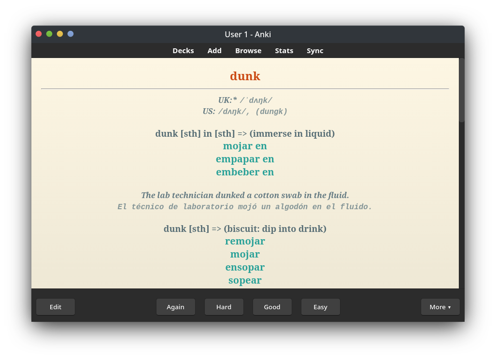
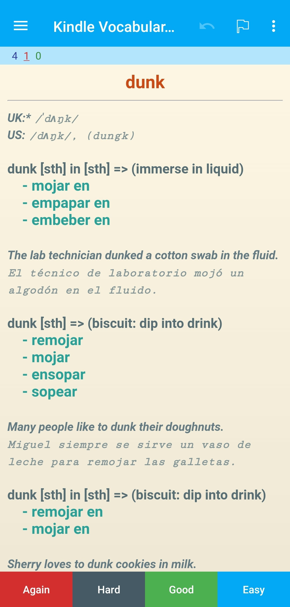

# Anki deck generator from kindle vocabulary
## Description

This is a simple python application that converts the kindle vocabulary database into an anki deck with traductions from word reference in a given languaje.
<p align="center">
  
  
</p>

## Installation

To use this application, follow these steps:

1. Clone the repository to your local machine:

```bash
$ git clone https://github.com/k1r0d3v/kindle_vocabulary.git
```

2. Navigate to the project directory:

```bash
$ cd kindle_vocabulary
```

3. Setup the environment:

```bash
$ ./setup.sh
```

## Usage

To run the application, execute the following command:

1. Activate the environment:
```bash
$ source env/bin/activate
```

2. And then execute with the 
```bash
$ python src/build_anki_deck.py
```

### Usage with kindle vocab.db
TODO

### Usage with a CSV
TODO

## Contributing

If you'd like to contribute to the development of this application, please follow these guidelines:

1. Fork the repository.
2. Create a new branch for your feature or bug fix.
3. Make your changes and commit them with descriptive messages.
4. Push your changes to your fork.
5. Submit a pull request.

## License

This project is licensed under the MIT License, see the LICENSE file for details.

## Third-Party Licenses

This project uses third-party libraries with the following licenses. For details, please refer to the [licenses](licenses.txt) file.
